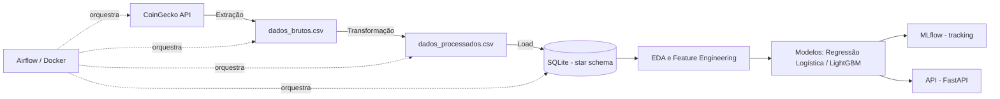

# Crypto Data Pipeline

[](https://github.com/OsvaldoSimao0823/crypto-data-pipeline/actions/workflows/testes.yml)

Pipeline de dados completo (ETL → orquestração → modelação → API) para preços diários de Bitcoin e Ethereum, com dados extraídos da API pública da CoinGecko.

Projeto construído para praticar o ciclo completo de Engenharia de Dados e Ciência de Dados: extração via API, modelação dimensional, orquestração com Airflow, testes automatizados com CI, análise exploratória, treino e avaliação honesta de modelos de Machine Learning, e uma API para servir o modelo.

## Arquitetura



## Stack tecnológica

| Categoria | Ferramentas |
|---|---|
| Extração e transformação | Python, pandas, requests |
| Armazenamento | SQLite (star schema: fact + dimension table) |
| Orquestração | Apache Airflow, Docker |
| Testes e qualidade | pytest, GitHub Actions (CI) |
| Análise e modelação | Jupyter, matplotlib, seaborn, scikit-learn, LightGBM |
| Tracking de experiências | MLflow |
| Serviço do modelo | FastAPI, uvicorn |

## Estrutura do projeto

```
crypto-pipeline/
├── extrair_dados.py         # Extração via API CoinGecko
├── transformar_dados.py     # Limpeza e agregação horária → diária
├── carregar_dados.py        # Load para SQLite
├── modelar_dados.py         # Star schema (fato_precos + dim_moeda)
├── test_dados.py            # Testes de qualidade de dados
├── eda.ipynb                # Análise exploratória, features, modelação, MLflow
├── api.py                   # API que serve o modelo treinado
├── dags/
│   └── crypto_pipeline_dag.py   # DAG do Airflow
├── docker-compose.yaml      # Ambiente Airflow
├── .github/workflows/
│   └── testes.yml           # CI: corre os testes a cada push
└── data/                    # Dados gerados (raw, processados, base de dados) — não versionado
```

## Como correr

### Pipeline manual
```bash
pip install -r requirements.txt
python extrair_dados.py
python transformar_dados.py
python carregar_dados.py
python modelar_dados.py
```

### Testes
```bash
pytest test_dados.py -v
```

### Orquestração com Airflow
```bash
docker compose up airflow-init
docker compose up -d
```
Interface em `http://localhost:8080` (utilizador/password: `airflow`).

### API
```bash
uvicorn api:app --reload
```
Documentação interativa em `http://127.0.0.1:8000/docs`.

## Resultados e conclusões

Foi treinado um modelo de classificação binária para prever se o preço de Bitcoin/Ethereum sobe ou desce no dia seguinte, usando features baseadas em retornos, médias móveis, volatilidade e retorno cruzado entre as duas moedas.

| Modelo | Accuracy (teste) |
|---|---|
| Baseline (prever sempre "sobe") | 56.5% |
| Regressão Logística (balanced) | 50% |
| LightGBM | 56% |

**Conclusão:** nenhum dos modelos superou a baseline de forma consistente. Isto é consistente com a hipótese do mercado eficiente na sua forma fraca — histórico de preços, isoladamente, não parece conter sinal suficiente para prever a direção do dia seguinte. A análise completa, incluindo EDA e o raciocínio de feature engineering, está documentada em `eda.ipynb`.

Este resultado negativo foi mantido deliberadamente no projeto, em vez de escondido — interpretar corretamente um modelo sem sinal preditivo é tão importante quanto construir um modelo com boa performance.

## Autor

Osvaldo Simão — [LinkedIn](https://linkedin.com/in/osvaldo-simao676767259)